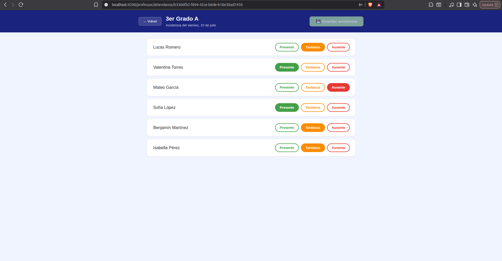
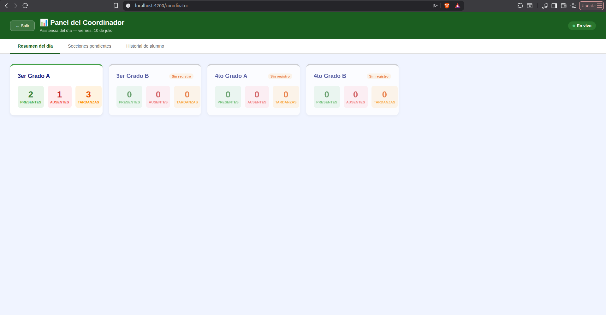

# Asistec — Sistema de Registro de Asistencia Escolar

Prueba técnica para Innova Schools. Módulo de asistencia diaria con dos perfiles: **Profesor** (registra asistencia) y **Coordinador** (consulta reportes en tiempo real).

---

## Requisitos previos

| Herramienta | Versión mínima |
| --- | --- |
| Java | 17 |
| Maven | 3.8+ |
| Node.js | 18+ |

> **No se requiere base de datos externa.** El backend usa H2 en memoria por defecto — arranca solo con Java y Maven, sin instalar nada más.

---

## Instalación y ejecución

### Backend

```bash
cd backend
mvn spring-boot:run
```

El servidor arranca en `http://localhost:8080`. Al iniciar por primera vez, el `DataInitializer` siembra automáticamente:

- 2 grados (3er y 4to), 4 secciones (3°A, 3°B, 4°A, 4°B), 6 estudiantes por sección.
- Asistencia de los últimos 5 días hábiles para 3°A, 3°B y 4°A.
- Asistencia de hoy solo para 3°A y 3°B (4°A y 4°B quedan pendientes para hoy).

### Frontend

```bash
cd frontend
npm install
npm start
```

La app arranca en `http://localhost:4200`. El proxy de Angular redirige `/api` → `http://localhost:8080`.

### Tests backend

```bash
cd backend
mvn test
```

Corre contra H2 en memoria (perfil `test`), sin necesidad de PostgreSQL ni Redis.

### Tests frontend

```bash
cd frontend
npx ng test --watch=false --browsers=ChromeHeadless
```

Requiere Chrome instalado. Corre 8 tests de componente con Karma + Jasmine.

---

## Capturas de pantalla

### Módulo Profesor — Registro de asistencia



### Módulo Coordinador — Dashboard en tiempo real



---

## Decisiones de diseño

### ¿Cómo modelaste la relación Sección → Estudiante → Registro de asistencia?

El modelo de dominio tiene tres entidades principales:

```text
Grade (1) ──→ (N) Section (1) ──→ (N) Student
                                         │
                                         ▼
                              AttendanceRecord (student, section, date, status)
```

`AttendanceRecord` no pertenece ni a `Section` ni a `Student` de forma exclusiva — pertenece al cruce de los tres: un estudiante, en una sección, en una fecha. Esto permite que el mismo registro soporte la restricción de unicidad `(student_id, section_id, date)` a nivel de base de datos.

La arquitectura es hexagonal (Ports & Adapters): las entidades de dominio (`Grade`, `Section`, `Student`, `AttendanceRecord`) no tienen ninguna anotación de Spring ni de JPA. Las anotaciones JPA están solo en las entidades de infraestructura (`*Entity`). El dominio es portable e independiente del ORM.

### ¿Cómo garantizaste que no existan dos registros del mismo estudiante para el mismo día?

Doble garantía:

1. **Validación en dominio**: antes de persistir, `RegisterAttendanceService` busca si ya existe un registro para `(studentId, sectionId, date)`. Si existe, actualiza el estado (upsert). Si no, crea uno nuevo.

2. **Constraint único en base de datos**: la tabla `attendance_record` tiene `UNIQUE (student_id, section_id, date)`. Aunque una race condition evadiera la validación de aplicación (dos requests simultáneos en la misma ventana de tiempo), la base de datos rechaza el segundo insert con `DataIntegrityViolationException`, que el `GlobalExceptionHandler` convierte en `409 Conflict`.

La capa de dominio protege el happy path. La base de datos protege el caso de concurrencia extrema.

### ¿Qué estrategia usaste para que el coordinador vea datos actualizados sin recargar?

**SSE (Server-Sent Events)** en lugar de WebSocket.

La razón: la comunicación es unidireccional — el servidor notifica al coordinador, el coordinador no le envía nada al servidor. SSE es exactamente eso: un canal HTTP persistente de servidor a cliente. WebSocket es bidireccional y agrega complejidad de protocolo (upgrade, heartbeats, frames) innecesaria para este caso.

Implementación:

- Backend: `SseEmitter` de Spring en `GET /api/v1/reports/stream`. Cada vez que un profesor guarda, el servicio publica el evento a todos los emitters activos.
- Frontend: `EventSource` nativo del browser, envuelto en un `Observable` de RxJS. Al recibir `attendance-updated`, el dashboard refresca el resumen.

### ¿Qué dejaste fuera intencionalmente? ¿Qué harías diferente con más tiempo?

**Fuera por decisión:**

- **Autenticación**: el MD la excluye explícitamente. El selector de rol en pantalla reemplaza el login.
- **Paginación en reportes**: el volumen de datos del seed no lo justifica.

**Ya implementado pero fuera del alcance mínimo del enunciado:**

- **Query agregada en daily summary**: `GET /reports/daily` usa una sola query `GROUP BY section_id` en lugar de N queries (una por sección).
- **Logging estructurado con MDC**: cada request tiene un `requestId` trazable en todos los logs.

**Lo que quedaría pendiente con más tiempo:**

1. **Timezone explícito**: los timestamps se devuelven sin zona horaria (`2026-07-09T10:23:45`). En producción deberían ser UTC explícito.
2. **Upsert atómico nativo**: en un entorno con PostgreSQL se podría usar `INSERT ... ON CONFLICT DO UPDATE` para eliminar la ventana de race condition entre el `find` y el `save`. La implementación actual usa `find + save` en el adapter, con el constraint único de BD como red de seguridad ante concurrencia extrema.

---

## Estructura del proyecto

```text
pinApp/
├── backend/                        # Spring Boot 3, Java 17, arquitectura hexagonal
│   └── src/main/java/.../asistec/
│       ├── domain/                 # Modelos, puertos, servicios (sin deps de Spring/JPA)
│       └── infrastructure/        # Controllers, JPA, SSE, configuración
├── frontend/                       # Angular 18, standalone components
│   └── src/app/
│       ├── features/professor/     # Formulario de registro de asistencia
│       └── features/coordinator/   # Dashboard con SSE
├── docs/
│   └── attendance-spec.md          # Spec del módulo (escrita antes del código)
└── asistec.postman_collection.json # 12 requests con UUIDs del seed y fechas dinámicas
```

---

## Colección Postman

Importar `asistec.postman_collection.json`. Contiene 12 endpoints con UUIDs reales del seed. Las fechas (`today`, `yesterday`, `weekAgo`) se calculan automáticamente mediante un pre-request script en la colección — no hace falta tocar nada para que funcionen el día que se evalúe.
